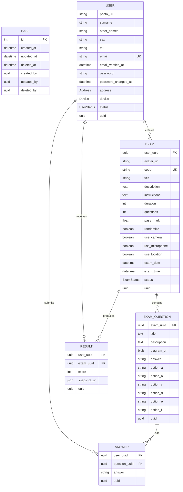

# Data Model

**Domain model** — the conceptual representation of real-world concepts and their relationships in a business domain (e.g., "a Realtor has many Leads, a Lead belongs to a Property"). Focuses on _meaning_ and _rules_, not implementation.

**Entities** — the key objects/nouns within a domain model that hold identity and state (e.g., `User`, `Lead`, `Realtor`, `Property`). These are the "things" the system is built around.

**Modules** — the code/system-level groupings that organize functionality (e.g., `auth`, `lead-routing`, `notifications`). Modules often map loosely to domains but focus on _how the system is structured_, not business meaning.

**Relationship**

- Domain model → defines the concepts and rules
- Core entities → the concrete nouns extracted from that domain model
- Modules → the technical boundaries built to implement and manage those entities/behaviors

**Analogy**: Domain model = the blueprint of a house (rooms and their purpose), core entities = the actual rooms (kitchen, bedroom), modules = the construction crews responsible for building/wiring each part (plumbing team, electrical team).

## Core Modules

- Exams
- Questions
- Candidates

## Models

> PROMPT: generate list of models for basic cbt web app

#### Generic Models

| Entity            | Description                                       |
| ----------------- | ------------------------------------------------- |
| User              | User auth and account info                        |
| Role              | User types: `admin`, `examiner`, `candidate`      |
| Permission        | Permitted resource, actions, and scope (optional) |
| RolePermission    | Permissions assigned to roles                     |
| UserRole / Policy | Users assigned to roles                           |
| Setting ⏳        | App configuration                                 |
| UserSetting ⏳    | User configuration                                |
| Notification ⏳   | Notification messages                             |
| AuditLog          | Captures in-app activities                        |

#### Domain Models

| Entity                  | Description                     |
| ----------------------- | ------------------------------- |
| Exam                    | Exam details                    |
| ExamQuestion / Question | Questions assigned to exams     |
| ExamCandidate           | Candidates assigned to exams    |
| Answer                  | Answers submitted by candidates |
| Result                  | Candidates scores               |

## Mermaid ERD

> PROMPT: generate erd mermaid markdown file for basic cbt web app

#### Constraints

- ANSWER user_uuid + question_uuid should be a `Composite Unique Key (CUK)`
- RESULT record should be immutable ✅
