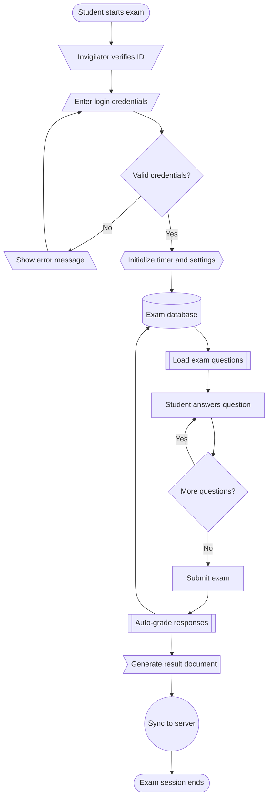

# Data Flow

## Flowchart

A **flowchart** is a diagram that visually represents the steps of a process using shapes and arrows, showing the sequence of actions, decisions, and outcomes from start to end.

- **Oval/rounded rectangle (Terminator)** — start/end points of a process
- **Rectangle (Process)** — a step, action, or task
- **Diamond (Decision)** — a yes/no or branching point
- **Parallelogram (Input/Output)** — data entering or leaving the process
- **Circle (Connector)** — links one part of the flowchart to another, often across pages
- **Arrow (Flow line)** — shows direction/sequence between shapes
- **Rectangle with double-struck sides (Predefined process/Subroutine)** — a step that's actually a separate, defined process elsewhere
- **Trapezoid (Manual operation)** — a step done manually, not by a system
- **Cylinder (Database)** — represents data storage
- **Document shape (wavy bottom)** — represents a document or report generated in the process
- **Hexagon (Preparation)** — a setup or initialization step before the main process begins

## Mermaid Flowchart

> PROMPT: generate mermaid syntax ONLY. use all flow chart shapes. represent cbt exam web app data flow

